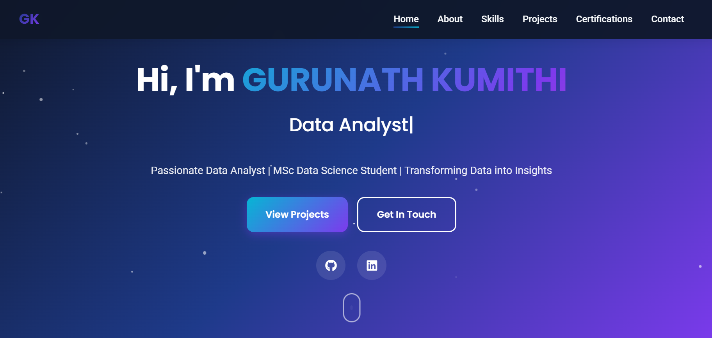

# Gurunath Kumithi – Portfolio Website



**Live Site:** [https://gurunath0007.github.io/](https://gurunath0007.github.io/)

## 👋 About

Hi, I'm Gurunath Kumithi, a passionate Data Analyst and MSc Data Science & Analytics student at the University of Hertfordshire.  
This portfolio showcases my technical skills, certifications, academic background, projects, and achievements in data analysis, Python, Power BI, and more.

---

## 🚀 Features

- **Mobile-first, responsive design:** Works perfectly on phones, tablets, desktops
- **Dark/Light theme toggle**
- **Professional, modern look** (Google Fonts + CSS3)
- **Project Highlights/Certifications**
- **SEO-optimized for Google indexing**
- **Static site, works on GitHub Pages**

---

## 💻 Demo

Preview here:  
👉 [https://gurunath0007.github.io/](https://gurunath0007.github.io/)

---

## 📁 File Structure

gurunath0007.github.io/
│
├── index.html # Main HTML file
├── style.css # CSS styles (Dark/Light/responsive)
├── app.js # JavaScript (theme toggle, typing effect)
├── robots.txt # SEO: allow search engines
├── sitemap.xml # For Google Search Console
├── README.md # This file!
└── [assets...] # (Optional: add images, favicon, etc)


---

## 🛠️ Tech Stack

- HTML5, CSS3, JS (Vanilla)
- Google Fonts: Poppins, Inter
- Font Awesome (CDN)
- Hosted on: **GitHub Pages**

---

## 📦 Setup & Deployment

1. **Clone this repo** or download as ZIP

    ```
    git clone https://github.com/Gurunath0007/gurunath0007.github.io
    ```

2. **Edit/Add your content**
    - `index.html`, `style.css`, etc.

3. **Push to main branch**
    - GitHub will auto-deploy to https://gurunath0007.github.io

4. **For custom domain:**  
    - Add your domain in GitHub Pages settings and add a `CNAME` file

---

## 🌐 SEO & Indexing

- Includes `robots.txt` and `sitemap.xml`
- Verified with Google Search Console
- Uses meta tags for description, keywords, Open Graph

---

## 📞 Contact

**Email:** kumithigurunath@gmail.com  
**LinkedIn:** [linkedin.com/in/gurunathkumithi](https://www.linkedin.com/in/gurunathkumithi)

---

## 📝 License

This portfolio is open for learning and personal use.  
**Feel free to fork and customize it for your own portfolio!**

---

_Developed & maintained by [Gurunath Kumithi](https://gurunath0007.github.io/)_
